<div align="center">
  
</div>
<div align="center">
  <a href="https://deepwiki.com/Empty-57/ZeroBit-Player"></a>
</div>

<p align="center">Logo来源：阿里巴巴矢量图库</p>

# ZeroBit Player
一款基于flutter+rust的Material风格本地音乐播放器

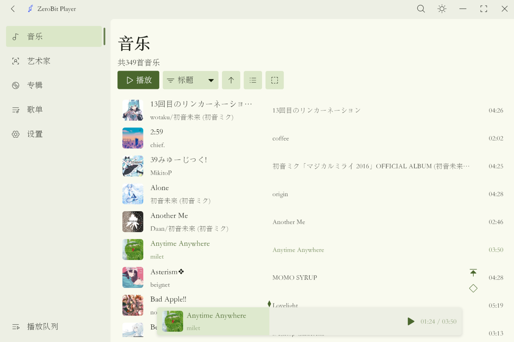

## 安装/快速开始
### 安装
[点击此处安装](https://github.com/Empty-57/ZeroBit-Player/releases/latest)
### 快速开始
- 安装Rust环境
- 安装Flutter SDK 版本>=3.7.2

### 安装依赖
```
flutter pub get
```

### 启动项目
```
flutter run
```

### 注意
编译后要把 BASS 库的 64 位的：
 - `bass.dll`
 - `bassalac.dll`
 - `bassape.dll`
 - `bassdsd.dll`
 - `bassflac.dll`
 - `bassmidi.dll`
 - `bassopus.dll`
 - `basswasapi.dll`
 - `basswebm.dll`
 - `basswv.dll`
 - `bass_fx.dll`

复制到软件目录的 `BASSDLL` 文件夹下

要把[`Zerobit Player Desktop Lyrics`](https://github.com/Empty-57/zerobit_player_desktop_lyrics)编译后的内容复制到软件目录的 `desktop_lyrics` 文件夹下以支持桌面歌词

## 特性
- 支持自定义歌单
- 支持读写（部分）元数据
- 支持读取内嵌歌词（部分）
- 支持读取本地歌词文件
- 支持多种音频格式
- 支持均衡器功能
- 支持从网络获取歌词数据
- 支持根据艺术家，专辑，文件夹分类
- 使用 Material 3 风格
- 支持自定义主题色和自定义字体
- 支持动态主题色
- 支持SMTC
- 支持音频可视化
- 支持桌面歌词

## 支持的音频格式
- aac
- ape
- aiff
- aif
- flac
- mp3
- mp4 m4a m4b m4p m4v
- mpc
- opus
- ogg
- oga
- spx
- wav
- wv

## 支持的歌词格式
- qrc
- yrc
- 逐行lrc 
- 逐字Lrc
- 增强型Lrc

## 支持读写的元数据格式
| 音频格式       | 元数据格式                        |
|------------|------------------------------|
| AAC (ADTS) | `ID3v2`, `ID3v1`             |
| Ape        | `APE`, `ID3v2`\*, `ID3v1`    |
| AIFF       | `ID3v2`, `Text Chunks`       |
| FLAC       | `Vorbis Comments`, `ID3v2`\* |
| MP3        | `ID3v2`, `ID3v1`, `APE`      |
| MP4        | `iTunes-style ilst`          |
| MPC        | `APE`, `ID3v2`\*, `ID3v1`\*  |
| Opus       | `Vorbis Comments`            |
| Ogg Vorbis | `Vorbis Comments`            |
| Speex      | `Vorbis Comments`            |
| WAV        | `ID3v2`, `RIFF INFO`         |
| WavPack    | `APE`, `ID3v1`               |

\* 由于缺乏官方支持，该标签将是**只读**的

## 关于歌词
默认会优先从音频相同的目录寻找同名的歌词文件，然后寻找同名的`.lrc`文件作为翻译数据，会优先寻找逐字歌词格式，如音频 `a.flac` 会先寻找 `a.qrc` 作为歌词数据，`a.lrc` 将会作为翻译数据（如果存在）
若不存在，则会扫描内嵌歌词</br>
若都不存在，则需要手动从网络选择歌词或者写入内嵌歌词</br>
若开启了自动下载选择的歌词，则会在选择歌词后，自动在音频同目录下创建原文文件和翻译文件（如果有）</br>

若选择了`.lrc`格式的歌词，有下面几种情况</br>
若包含注音，会将相同时间戳的歌词行第一行作为注音，第二行作为原文，第三行作为翻译</br>
例如：</br>
```
[00:24.212]qi  yo to ma ga sa xi ta n da         这一行将会作为注音
[00:24.212]ちょっと魔がさしたんだ                  这一行将会作为原文
[00:24.212]我是有点鬼迷心窍了                      这一行将会作为翻译
```

若不包含注音，会将相同时间戳的歌词行第一行作为原文，第二行作为翻译</br>
例如：</br>
```
[00:24.212]ちょっと魔がさしたんだ                   这一行将会作为原文
[00:24.212]我是有点鬼迷心窍了                      这一行将会作为翻译
```

若只有一行，则会通过 ` / ` 分割歌词行，` / `前面的作为原文，` / `后面的作为翻译</br>
例如：</br>
```
[00:24.21]ちょっと魔がさしたんだ / 我是有点鬼迷心窍了     / 前面将会作为原文 / 后面将会作为翻译
```

若使用了[LDDC](https://github.com/chenmozhijin/LDDC)来匹配本地歌词并且将歌词文件保存到歌曲同目录时，仍然会优先使用 `.qrc` `.yrc` 格式的歌词文件作为原文，请先删除上述两种格式的文件以使用[LDDC](https://github.com/chenmozhijin/LDDC)歌词

使用[LDDC](https://github.com/chenmozhijin/LDDC)来匹配本地歌词时，可以选择将歌词 `保存到歌曲标签` ，也可以选择将歌词文件 `保存到歌曲文件夹` ，歌词文件名请选择 `与歌曲文件名相同` 

使用[LDDC](https://github.com/chenmozhijin/LDDC)时，为了兼容罗马音，原文，翻译的渲染，请在[LDDC](https://github.com/chenmozhijin/LDDC)的 `设置` 的 `歌词设置` 的 `顺序` 选项卡选择: 罗马音->原文->译文

若要搜索歌词，请通过输入歌曲信息，搜索更精确的歌词：</br>

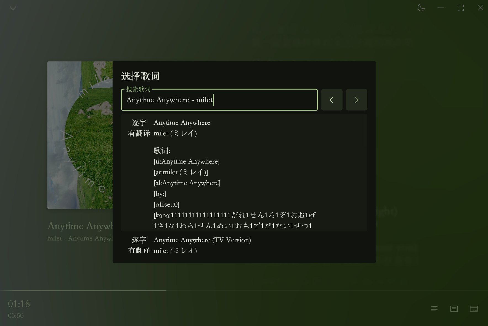

手动写入内嵌歌词：</br>


## 关于歌曲封面
可以选择本地图片作为封面,也可以点击 `网络封面` 来设置封面</br>
若使用 `网络封面` 来设置封面，会以当前设置的API源来匹配封面，请尽量正确填写元数据（标题，艺术家，专辑）以提高匹配准确率</br>
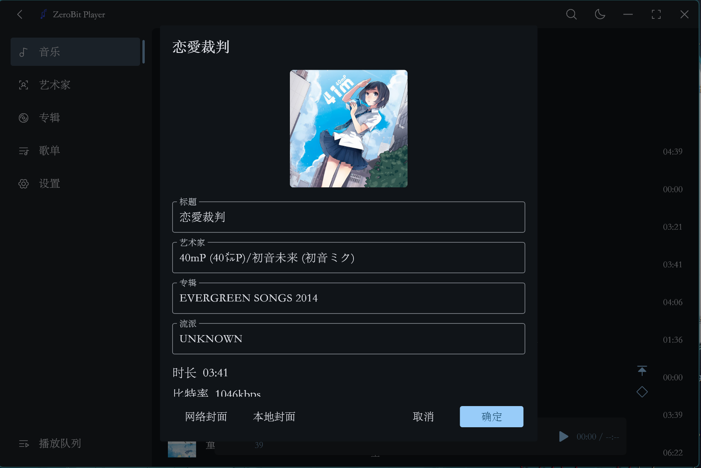

## 提交BUG或者PR
- 若提交BUG，请创建一个新的 issue，尽可能说明复现步骤并提供截图。
- 若提交PR，请检查代码是否有潜在隐患并尽量做一些优化。

## 注意
若软件发生了严重错误，可尝试到目录 `C:\Users\<用户名>\Documents` 下删除所有 `.hive` 以及同名的 `.lock` 的后缀的配置文件

1.4.3以后的版本，配置文件的位置从 `C:\Users\<用户名>\Documents` 移动到 `C:\Users\<用户名>\Documents\zerobit_config` 

## 感谢
[coriander_player](https://github.com/Ferry-200/coriander_player)： 借鉴了UI设计</br>
[BASS](https://www.un4seen.com/)： 播放器内核</br>
[Lofty](https://crates.io/crates/lofty)： 读取音频元数据

## 桌面歌词展示

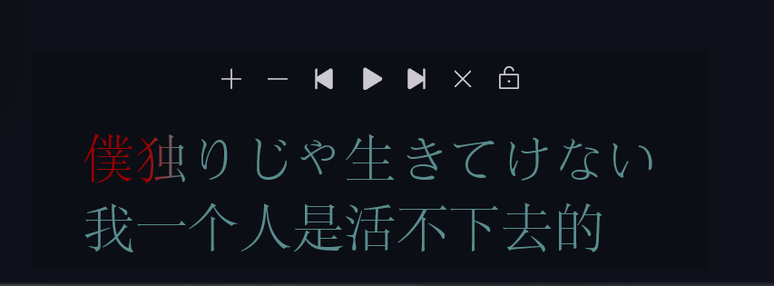
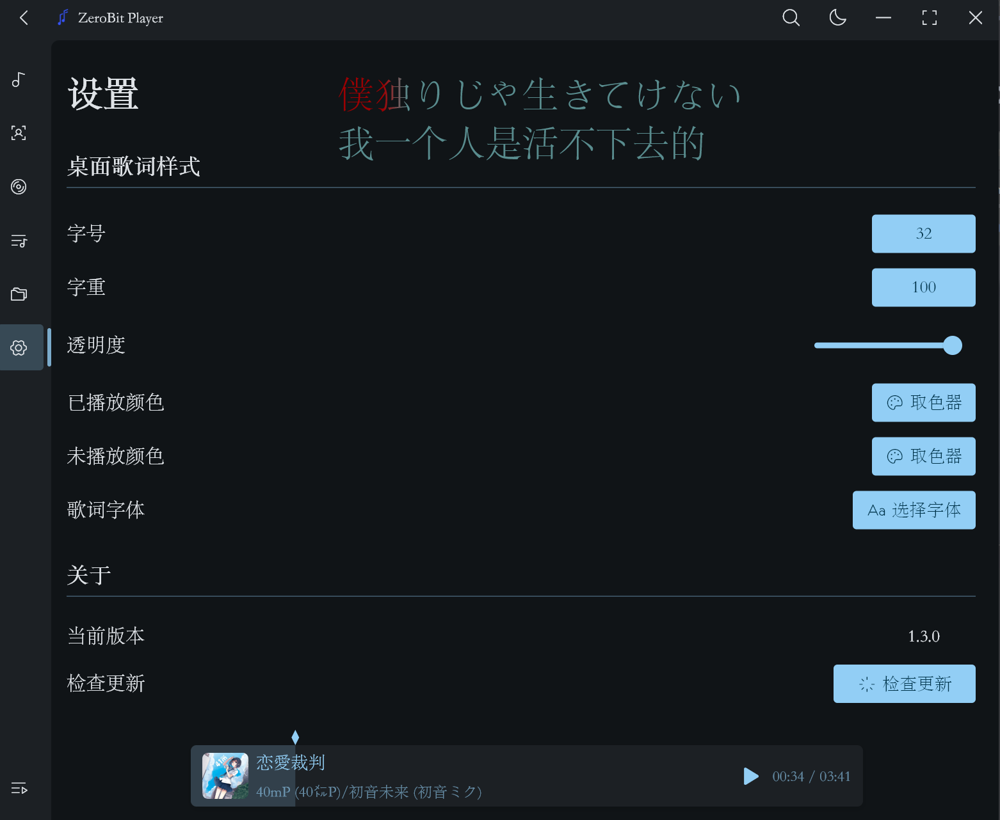

## 软件截图
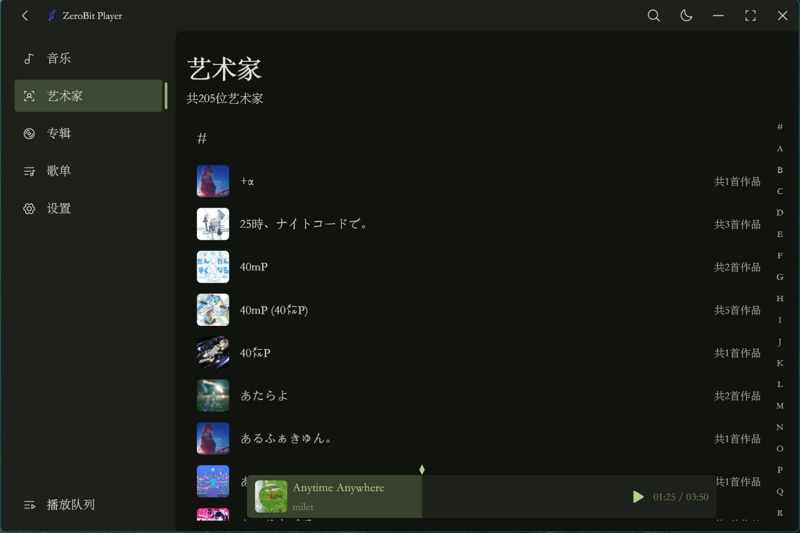
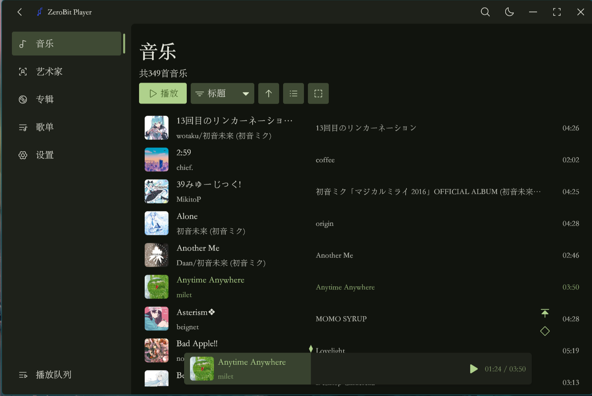
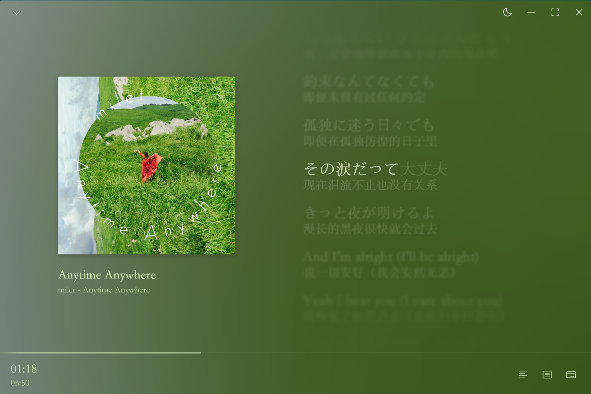
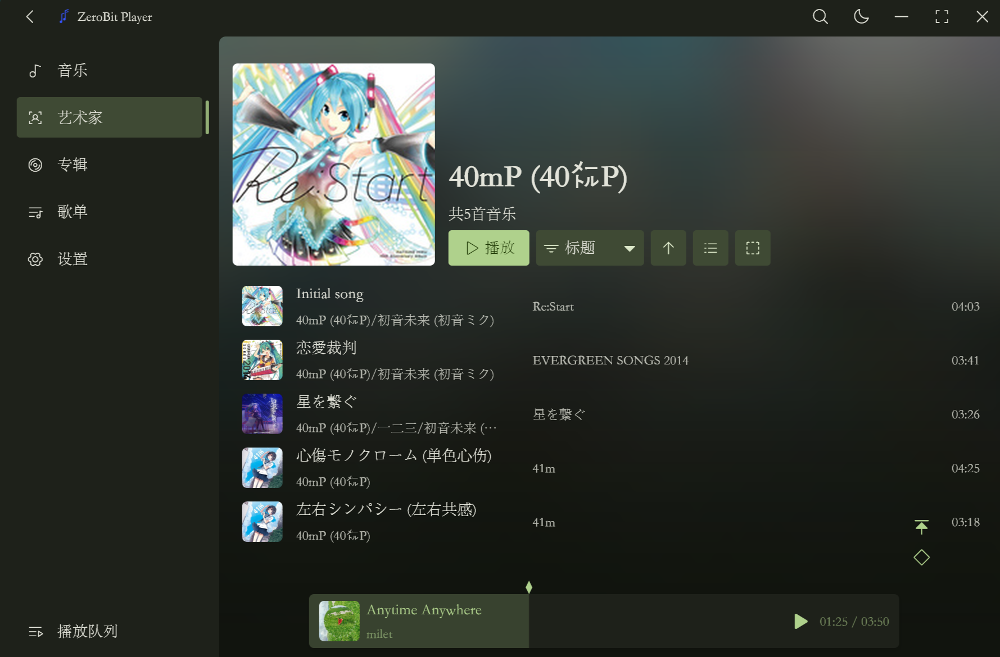

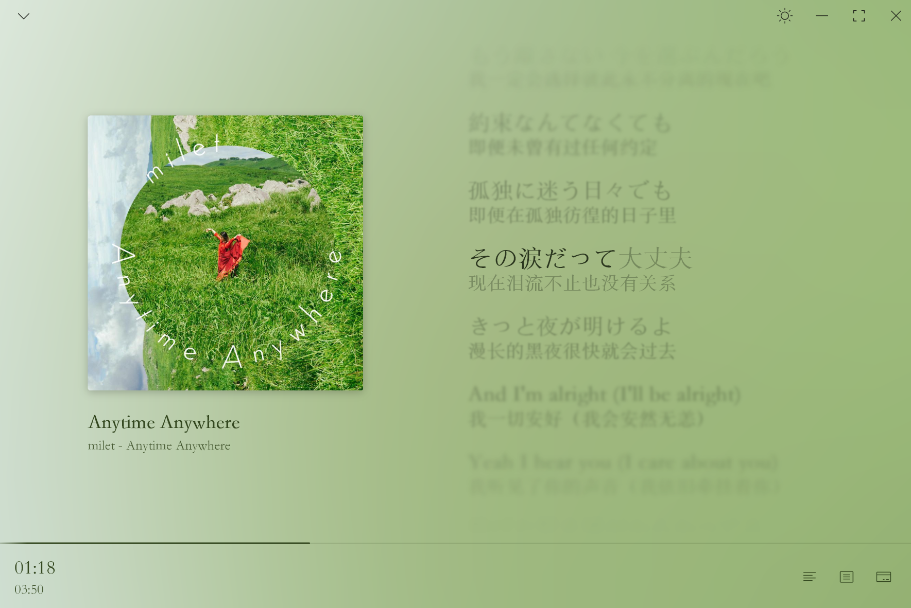

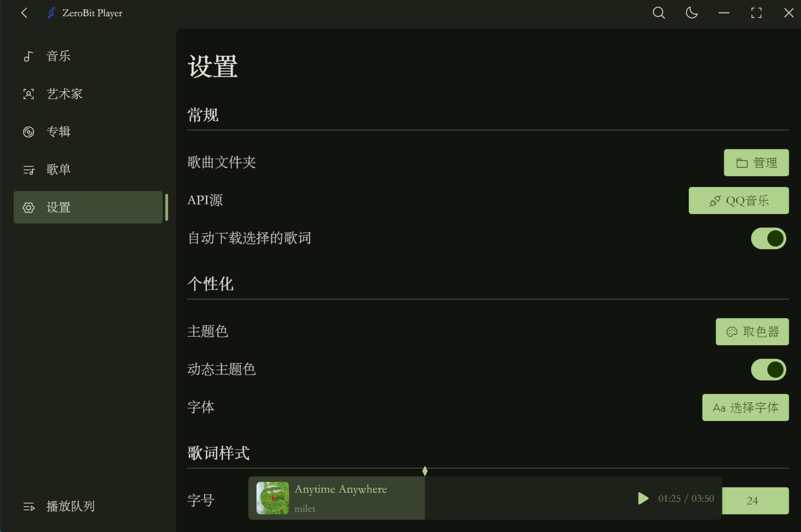
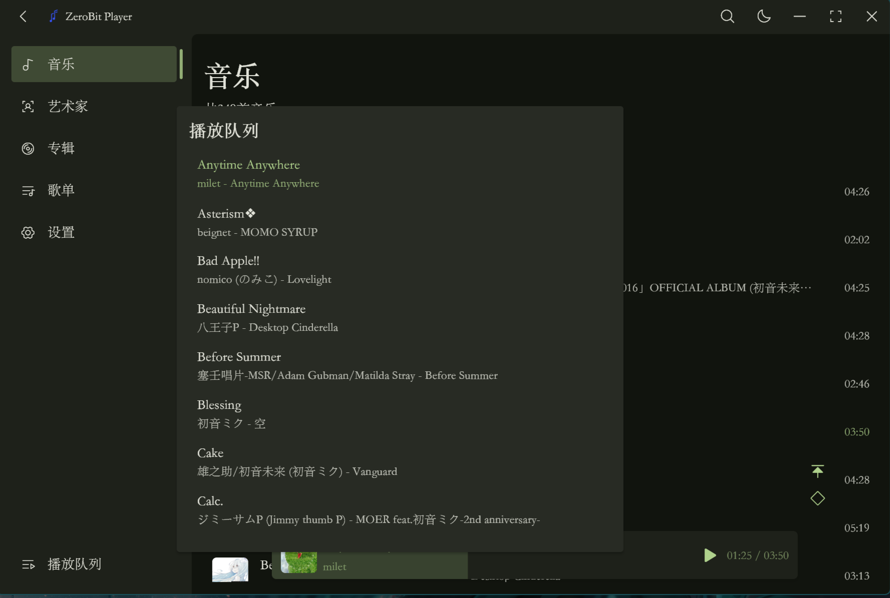

